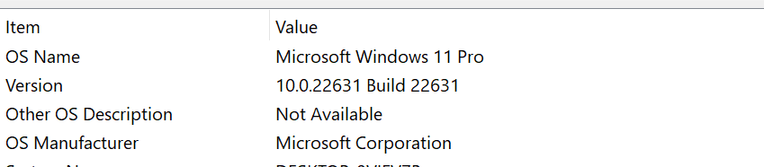

# Dev_Setup
Setup Development Environment

#Assignment: Setting Up Your Developer Environment

#Objective:
This assignment aims to familiarize you with the tools and configurations necessary to set up an efficient developer environment for software engineering projects. Completing this assignment will give you the skills required to set up a robust and productive workspace conducive to coding, debugging, version control, and collaboration.

#Tasks:

1. Select Your Operating System (OS):
   Choose an operating system that best suits your preferences and project requirements. Download and Install Windows 11. https://www.microsoft.com/software-download/windows11

   Download the Media Creation Tool: From the Windows 11 download page, download the Media Creation Tool.
Run the Tool: Follow the instructions to create a bootable USB drive.
Install Windows 11:
Insert the USB drive into the PC where you want to install Windows 11.
Restart your PC and boot from the USB drive.
Follow the on-screen instructions to complete the installation.
Select Language, Time, and Keyboard Preferences.
Click Install Now.
Enter Product Key (if prompted).
Accept License Terms.
Choose Installation Type: Select "Custom: Install Windows only (advanced)" if doing a clean installation.
Select the Drive where you want to install Windows 11.
Follow Additional Prompts to complete the installation.

2. Install a Text Editor or Integrated Development Environment (IDE):
   Select and install a text editor or IDE suitable for your programming languages and workflow. Download and Install Visual Studio Code. https://code.visualstudio.com/Download

   Download Visual Studio
Open a Web Browser:
Launch your preferred web browser (e.g., Chrome, Firefox, Edge).
Visit the Visual Studio Code Download Page:
Navigate to the official Visual Studio Code download page.
Choose Your Operating System:
Click the appropriate download link for your operating system (Windows, macOS, or Linux).
Install Visual Studio Code on Windows
Run the Installer:
Once the download is complete, locate the installer file (it will have a .exe extension) and double-click to run it.
Accept the License Agreement:
Read and accept the license agreement by checking the box and clicking Next.
Choose Installation Location:
Select the destination folder for VS Code or use the default location, then click Next.
Select Additional Tasks:
You can choose to create a desktop icon, add VS Code to the PATH (important for command-line use), and other tasks. Make your selections and click Next.
Install:
Click Install to begin the installation process. Wait for it to complete.
Launch Visual Studio Code:
Once the installation is complete, you can choose to launch Visual Studio Code immediately by checking the relevant box and clicking Finish.

3. Set Up Version Control System:
   Install Git and configure it on your local machine. Create a GitHub account for hosting your repositories. Initialize a Git repository for your project and make your first commit. https://github.com

   On Windows
Download Git for Windows:
Go to the Git for Windows download page.
Click on the "Download" button to download the installer.
Run the Installer:
Locate the downloaded installer file and double-click to run it.
Follow the installation steps, accepting the default settings (or customizing them if needed):
Select the installation location.
Choose the components to install.
Select the default editor used by Git.
Adjust the PATH environment (select "Git from the command line and also from 3rd-party software" for the easiest use).
Choose the HTTPS transport backend (use the OpenSSL library).
Configure the line ending conversions (use the recommended option).
Decide the terminal emulator to use with Git Bash (use MinTTY).
Choose the default behavior of git pull.
Complete Installation:

Click "Install" and wait for the installation to complete.
Optionally, launch Git Bash and Git GUI.

Create a GitHub Account
Go to the GitHub Website:
Open your web browser and navigate to the GitHub sign-up page.
Fill Out the Registration Form:
Enter a username.
Enter your email address.
Create and confirm a password.
Solve the puzzle to verify you are human.
Click "Create account."
Verify Your Email Address:
GitHub will send a verification email to the address you provided.
Open the email and click the verification link.
Personalize Your Account (optional):
You can choose your preferences and set up additional options like selecting a plan (the free plan is suitable for most users).

4. Install Necessary Programming Languages and Runtimes:
  Instal Python from http://wwww.python.org programming language required for your project and install their respective compilers, interpreters, or runtimes. Ensure you have the necessary tools to build and execute your code.

Open Visual studio Code 
click on the extensions Icon,
Search for python, click install.

5. Install Package Managers:
   If applicable, install package managers like pip (Python).

   Download get-pip.py:
Download the get-pip.py script from bootstrap.pypa.io and save it to a local directory.
Run get-pip.py:
Open a terminal or command prompt and navigate to the directory where get-pip.py is saved.
Run the following command:
python get-pip.py

6. Configure a Database (MySQL):
   Download and install MySQL database. https://dev.mysql.com/downloads/windows/installer/5.7.html

   Download MySQL Installer
Visit the MySQL Downloads Page:
Go to the MySQL Community Downloads.
Download the MySQL Installer:
Click on "MySQL Installer for Windows".
Choose the appropriate installer based on your needs:
Full Installer: A larger installer that contains all MySQL products.
Step 2: Install MySQL
Run the Installer:
Locate the downloaded file and double-click to run it.
Follow the Setup Wizard:
Choose Setup Type: Select "Custom" if you want specific components.
Check Requirements: The installer will check for required software and prompt you to install any missing components.
Select Products and Features: Confirm the products and features to be installed.
Configuration:
Type and Networking: Choose the server type (e.g., "Development Machine") and configure the port (default is 3306).
Authentication: Set a strong root password and optionally create additional user accounts.
Windows Service: Choose to run MySQL as a Windows service and start it automatically.
Apply Configuration:
Review the configuration summary and click "Execute" to apply the configuration.
Complete Installation:
Once the configuration is applied, click "Finish" to complete the installation.

7. Set Up Development Environments and Virtualization (Optional):
   Consider using virtualization tools like Docker or virtual machines to isolate project dependencies and ensure consistent environments across different machines.

8. Explore Extensions and Plugins:
   Explore available extensions, plugins, and add-ons for your chosen text editor or IDE to enhance functionality, such as syntax highlighting, linting, code formatting, and version control integration.

   

9. Document Your Setup:
    Create a comprehensive document outlining the steps you've taken to set up your developer environment. Include any configurations, customizations, or troubleshooting steps encountered during the process. 

#Deliverables:
- Document detailing the setup process with step-by-step instructions and screenshots where necessary.
- A GitHub repository containing a sample project initialized with Git and any necessary configuration files (e.g., .gitignore).
- A reflection on the challenges faced during setup and strategies employed to overcome them.

Reference:
PLP Notes
AI
#Submission:
Submit your document and GitHub repository link through the designated platform or email to the instructor by the specified deadline.

#Evaluation Criteria:**
- Completeness and accuracy of setup documentation.
- Effectiveness of version control implementation.
- Appropriateness of tools selected for the project requirements.
- Clarity of reflection on challenges and solutions encountered.
- Adherence to submission guidelines and deadlines.

Note: Feel free to reach out for clarification or assistance with any aspect of the assignment.
